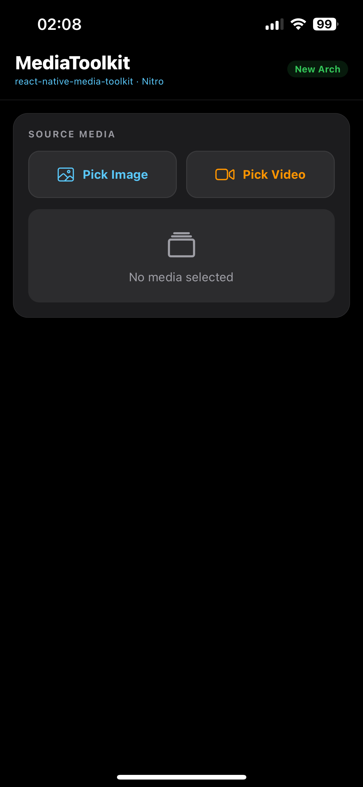
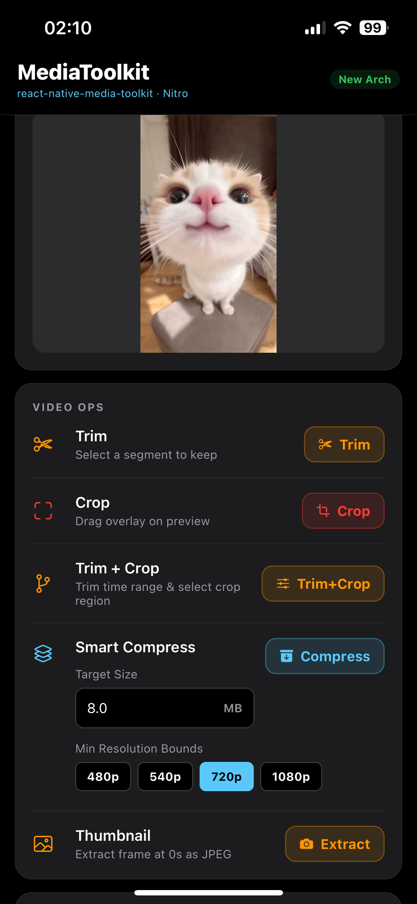

# react-native-media-toolkit

Đọc bản này bằng: [English](./README.md)

---

Thư viện xử lý ảnh và video native cho React Native — cắt ảnh, cắt video, nén, và trích xuất thumbnail.  
Xây dựng trên **Nitro Modules** (JSI), dùng `AVFoundation` trên iOS và **Jetpack Media3 Transformer** trên Android. Không phụ thuộc FFmpeg.

[](https://www.npmjs.com/package/react-native-media-toolkit)
[](LICENSE)

<p align="center">
  
  &nbsp;&nbsp;
  
  &nbsp;&nbsp;
  
</p>

---

## Tương thích

| Môi trường | Hỗ trợ |
|---|---|
| React Native CLI (New Architecture) | Có |
| Expo với Dev Client / Custom Build | Có |
| Expo Go | Không hỗ trợ (yêu cầu native build) |
| React Native | 0.75+ (bắt buộc New Architecture) |
| iOS | 15.1+ |
| Android | API 24+ (Android 7.0) |

> **Lưu ý Expo:** Thư viện yêu cầu native build. Không thể dùng với Expo Go.  
> Dùng `expo run:ios` hoặc `expo run:android` thay thế.

---

## Tính năng

| Tính năng | iOS | Android |
|---|---|---|
| Cắt ảnh | AVFoundation / CGImage | Bitmap |
| Nén ảnh | CGImageSource (Chống OOM) | BitmapFactory / inSampleSize |
| Lật / Xoay ảnh | CGImage / CoreGraphics | Bitmap |
| Xử lý đa tác vụ ảnh | CGImage / CoreGraphics | Bitmap |
| Cắt video theo thời gian (ms) | AVAssetExportSession | Media3 Transformer |
| Cắt vùng video (tương đối) | AVMutableVideoComposition | Media3 Presentation |
| Lật / Xoay video | AVMutableVideoComposition | Media3 Presentation |
| Cắt thời gian + cắt vùng trong 1 lần encode | AVMutableVideoComposition | Media3 Transformer |
| Xử lý đa tác vụ video | AVMutableVideoComposition | Media3 Transformer |
| Nén video | AVAssetExportSession presets | Media3 Transformer |
| Lấy thumbnail từ video | AVAssetImageGenerator | MediaMetadataRetriever |

Mọi tọa độ crop dùng **hệ tương đối (0.0–1.0)** — không phụ thuộc độ phân giải màn hình.

---

## Cài đặt

```sh
npm install react-native-media-toolkit react-native-nitro-modules
# hoặc
yarn add react-native-media-toolkit react-native-nitro-modules
```

**iOS:**
```sh
cd ios && pod install
```

**Android:** Không cần bước thêm. Gradle tự xử lý Media3.

---

## Sử dụng

```typescript
import { MediaToolkit } from 'react-native-media-toolkit';
```

### Cắt ảnh

```typescript
const result = await MediaToolkit.cropImage(imageUri, {
  x: 0.25,      // bắt buộc — offset trái so với chiều rộng ảnh (0.0–1.0)
  y: 0.25,      // bắt buộc — offset trên so với chiều cao ảnh (0.0–1.0)
  width: 0.5,   // bắt buộc — chiều rộng vùng cắt so với chiều rộng ảnh (0.0–1.0)
  height: 0.5,  // bắt buộc — chiều cao vùng cắt so với chiều cao ảnh (0.0–1.0)
  outputPath: '/custom/path/out.jpg', // tuỳ chọn
});
console.log(result.uri, result.width, result.height);
```

### Nén ảnh

```typescript
const result = await MediaToolkit.compressImage(imageUri, {
  quality: 70,       // tuỳ chọn — 0–100, mặc định 80
  maxWidth: 1080,    // tuỳ chọn — chiều rộng tối đa, giữ nguyên tỉ lệ
  maxHeight: 1920,   // tuỳ chọn — chiều cao tối đa, giữ nguyên tỉ lệ
  format: 'jpeg',    // tuỳ chọn — 'jpeg' | 'png' | 'webp', mặc định 'jpeg'
});
```

### Lật ảnh

```typescript
const result = await MediaToolkit.flipImage(imageUri, {
  direction: 'horizontal', // 'horizontal' | 'vertical'
});
```

### Xoay ảnh

```typescript
const result = await MediaToolkit.rotateImage(imageUri, {
  degrees: 90, // 90, 180, 270
});
```

### Xử lý đa tác vụ ảnh (Multi-transform)

Chạy nhiều thao tác trong một lần duy nhất để tiết kiệm thời gian xử lý và bộ nhớ.
```typescript
const result = await MediaToolkit.processImage(imageUri, {
  cropX: 0.1,
  cropY: 0.1,
  cropWidth: 0.8,
  cropHeight: 0.8,
  flip: 'horizontal',
  rotation: 90,
});
```

### Cắt video theo thời gian

```typescript
const result = await MediaToolkit.trimVideo(videoUri, {
  startTime: 2000,  // thời điểm bắt đầu (milliseconds)
  endTime: 7000,    // thời điểm kết thúc (milliseconds)
});
```

### Cắt vùng video

```typescript
const result = await MediaToolkit.cropVideo(videoUri, {
  x: 0.1,
  y: 0.1,
  width: 0.8,
  height: 0.8,
});
```

### Cắt thời gian + cắt vùng trong 1 lần encode

```typescript
const result = await MediaToolkit.trimAndCropVideo(videoUri, {
  startTime: 1000,
  endTime: 8000,
  x: 0.0,
  y: 0.1,
  width: 1.0,
  height: 0.8,
});
```

> Nhanh hơn so với chạy trim và crop riêng lẻ — chỉ encode 1 lần duy nhất.

### Nén video

Bộ nén hỗ trợ hai chế độ. Dùng **một trong hai**:

**Chế độ 1 — Smart compress theo dung lượng mục tiêu** (khuyến nghị):
```typescript
const result = await MediaToolkit.compressVideo(videoUri, {
  targetSizeInMB: 8,   // bắt buộc cho chế độ này — dung lượng output mục tiêu (MB)
  minResolution: 480,  // tuỳ chọn — độ phân giải ngắn nhất tối thiểu (mặc định 720)
  muteAudio: false,    // tuỳ chọn — loại bỏ âm thanh (mặc định false)
  width: 1280,         // tuỳ chọn — chiều rộng tối đa, giữ nguyên tỉ lệ
});
```

**Chế độ 2 — Preset chất lượng hoặc bitrate thủ công**:
```typescript
const result = await MediaToolkit.compressVideo(videoUri, {
  quality: 'medium',   // tuỳ chọn — 'low' | 'medium' | 'high' (mặc định 'medium')
  bitrate: 2_000_000,  // tuỳ chọn — bitrate thủ công (bps), ghi đè quality
  muteAudio: false,    // tuỳ chọn — loại bỏ âm thanh (mặc định false)
  width: 1280,         // tuỳ chọn — chiều rộng tối đa, giữ nguyên tỉ lệ
});
```

> **Lưu ý:** `targetSizeInMB`, `quality`, và `bitrate` đều là **tuỳ chọn** — nhưng thư viện cần ít nhất một tín hiệu để xác định bitrate. Nếu không truyền gì cả, mặc định là `quality: 'medium'` (~4 Mbps). `targetSizeInMB` có độ ưu tiên cao nhất; `bitrate` ghi đè `quality`.

### Lấy thumbnail từ video

```typescript
const thumb = await MediaToolkit.getThumbnail(videoUri, {
  timeMs: 3000,    // thời điểm lấy frame (milliseconds), mặc định 0
  quality: 85,     // 0–100, mặc định 80
  maxWidth: 720,   // chiều rộng thumbnail tối đa (không ảnh hưởng metadata trả về)
});
// thumb.uri      → file JPEG thumbnail
// thumb.width    → chiều rộng video gốc (đã xoay đúng)
// thumb.height   → chiều cao video gốc
// thumb.size     → dung lượng video gốc (bytes)
// thumb.duration → thời lượng video gốc (ms)
```

### Lật video

```typescript
const result = await MediaToolkit.flipVideo(videoUri, {
  direction: 'horizontal', // 'horizontal' | 'vertical'
});
```

### Xoay video

```typescript
const result = await MediaToolkit.rotateVideo(videoUri, {
  degrees: 90, // 90, 180, 270
});
```

### Xử lý đa tác vụ video (Multi-transform)

Chạy nhiều thao tác video trong một lần encode (trim, crop, flip, rotate).
```typescript
const result = await MediaToolkit.processVideo(videoUri, {
  startTime: 1000,
  endTime: 8000,
  cropX: 0.1,
  cropY: 0.1,
  cropWidth: 0.8,
  cropHeight: 0.8,
  flip: 'horizontal',
  rotation: 90,
});
```

---

## API Reference

> **Quy ước:** `Bắt buộc` = phải truyền vào. `Tuỳ chọn` = có giá trị mặc định hợp lý, có thể bỏ qua.

### `cropImage(uri, options): Promise<MediaResult>`

| Option | Kiểu | Bắt buộc | Mô tả |
|---|---|---|---|
| `x` | `number` | **Bắt buộc** | Offset trái so với chiều rộng ảnh (0.0–1.0) |
| `y` | `number` | **Bắt buộc** | Offset trên so với chiều cao ảnh (0.0–1.0) |
| `width` | `number` | **Bắt buộc** | Chiều rộng vùng cắt so với chiều rộng ảnh (0.0–1.0) |
| `height` | `number` | **Bắt buộc** | Chiều cao vùng cắt so với chiều cao ảnh (0.0–1.0) |
| `outputPath` | `string` | Tuỳ chọn | Đường dẫn tuyệt đối file output. Mặc định là file tạm. |

### `compressImage(uri, options): Promise<MediaResult>`

Tất cả options đều là tuỳ chọn. Có thể truyền object rỗng `{}` để dùng toàn bộ giá trị mặc định.

| Option | Kiểu | Mặc định | Mô tả |
|---|---|---|---|
| `quality` | `number` | `80` | Chất lượng encode JPEG/WebP (0–100) |
| `maxWidth` | `number` | gốc | Chiều rộng tối đa output (px, giữ tỉ lệ) |
| `maxHeight` | `number` | gốc | Chiều cao tối đa output (px, giữ tỉ lệ) |
| `format` | `string` | `'jpeg'` | Định dạng output: `'jpeg'` \| `'png'` \| `'webp'` |
| `outputPath` | `string` | file tạm | Đường dẫn tuyệt đối file output |

### `flipImage(uri, options): Promise<MediaResult>`
### `flipVideo(uri, options): Promise<MediaResult>`

| Option | Kiểu | Bắt buộc | Mô tả |
|---|---|---|---|
| `direction` | `string` | **Bắt buộc** | `'horizontal'` hoặc `'vertical'` |
| `outputPath` | `string` | Tuỳ chọn | Đường dẫn tuyệt đối file output. Mặc định là file tạm. |

### `rotateImage(uri, options): Promise<MediaResult>`
### `rotateVideo(uri, options): Promise<MediaResult>`

| Option | Kiểu | Bắt buộc | Mô tả |
|---|---|---|---|
| `degrees` | `number` | **Bắt buộc** | `90`, `180`, hoặc `270` |
| `outputPath` | `string` | Tuỳ chọn | Đường dẫn tuyệt đối file output. Mặc định là file tạm. |

### `processImage(uri, options): Promise<MediaResult>`

Xử lý đa tác vụ ảnh. Tất cả options đều là **tuỳ chọn**.

| Option | Kiểu | Mô tả |
|---|---|---|
| `cropX` | `number` | Offset trái so với chiều rộng ảnh (0.0–1.0) |
| `cropY` | `number` | Offset trên so với chiều cao ảnh (0.0–1.0) |
| `cropWidth` | `number` | Chiều rộng vùng cắt so với chiều rộng ảnh (0.0–1.0) |
| `cropHeight` | `number` | Chiều cao vùng cắt so với chiều cao ảnh (0.0–1.0) |
| `flip` | `string` | `'horizontal'` hoặc `'vertical'` |
| `rotation` | `number` | `90`, `180`, hoặc `270` |
| `outputPath` | `string` | Đường dẫn tuyệt đối file output. Mặc định là file tạm. |

### `trimVideo(uri, options): Promise<MediaResult>`

| Option | Kiểu | Bắt buộc | Mô tả |
|---|---|---|---|
| `startTime` | `number` | **Bắt buộc** | Thời điểm bắt đầu cắt (milliseconds) |
| `endTime` | `number` | **Bắt buộc** | Thời điểm kết thúc cắt (milliseconds) |
| `outputPath` | `string` | Tuỳ chọn | Đường dẫn tuyệt đối file output. Mặc định là file tạm. |

### `cropVideo(uri, options): Promise<MediaResult>`

Cùng hệ toạ độ tương đối với `cropImage` — tất cả giá trị trong khoảng (0.0–1.0).

| Option | Kiểu | Bắt buộc | Mô tả |
|---|---|---|---|
| `x` | `number` | **Bắt buộc** | Offset trái so với chiều rộng frame (0.0–1.0) |
| `y` | `number` | **Bắt buộc** | Offset trên so với chiều cao frame (0.0–1.0) |
| `width` | `number` | **Bắt buộc** | Chiều rộng vùng cắt so với chiều rộng frame (0.0–1.0) |
| `height` | `number` | **Bắt buộc** | Chiều cao vùng cắt so với chiều cao frame (0.0–1.0) |
| `outputPath` | `string` | Tuỳ chọn | Đường dẫn tuyệt đối file output. Mặc định là file tạm. |

### `trimAndCropVideo(uri, options): Promise<MediaResult>`

Kết hợp trim và crop trong **một lần encode duy nhất** — nhanh hơn và tránh mất chất lượng do encode 2 lần.

| Option | Kiểu | Bắt buộc | Mô tả |
|---|---|---|---|
| `startTime` | `number` | **Bắt buộc** | Thời điểm bắt đầu cắt (milliseconds) |
| `endTime` | `number` | **Bắt buộc** | Thời điểm kết thúc cắt (milliseconds) |
| `x` | `number` | **Bắt buộc** | Offset trái vùng cắt so với chiều rộng frame (0.0–1.0) |
| `y` | `number` | **Bắt buộc** | Offset trên vùng cắt so với chiều cao frame (0.0–1.0) |
| `width` | `number` | **Bắt buộc** | Chiều rộng vùng cắt so với chiều rộng frame (0.0–1.0) |
| `height` | `number` | **Bắt buộc** | Chiều cao vùng cắt so với chiều cao frame (0.0–1.0) |
| `outputPath` | `string` | Tuỳ chọn | Đường dẫn tuyệt đối file output. Mặc định là file tạm. |

### `processVideo(uri, options): Promise<MediaResult>`

Xử lý đa tác vụ video trong một lần duy nhất (trim, crop, flip, rotate). Tất cả options đều là **tuỳ chọn**.

| Option | Kiểu | Mô tả |
|---|---|---|
| `startTime` | `number` | Thời điểm bắt đầu cắt (milliseconds) |
| `endTime` | `number` | Thời điểm kết thúc cắt (milliseconds) |
| `cropX` | `number` | Offset trái vùng cắt so với chiều rộng frame (0.0–1.0) |
| `cropY` | `number` | Offset trên vùng cắt so với chiều cao frame (0.0–1.0) |
| `cropWidth` | `number` | Chiều rộng vùng cắt so với chiều rộng frame (0.0–1.0) |
| `cropHeight` | `number` | Chiều cao vùng cắt so với chiều cao frame (0.0–1.0) |
| `flip` | `string` | `'horizontal'` hoặc `'vertical'` |
| `rotation` | `number` | `90`, `180`, hoặc `270` |
| `outputPath` | `string` | Đường dẫn tuyệt đối file output. Mặc định là file tạm. |

### `compressVideo(uri, options): Promise<MediaResult>`

Tất cả options đều **tuỳ chọn**. Thứ tự ưu tiên xác định bitrate như sau:

1. **`targetSizeInMB`** → smart-compress: tính bitrate và độ phân giải tối ưu từ duration + dung lượng mục tiêu *(ưu tiên cao nhất)*
2. **`bitrate`** → bitrate thủ công *(ghi đè `quality`)*
3. **`quality`** → preset: `low` ≈ 1 Mbps · `medium` ≈ 4 Mbps · `high` ≈ 8 Mbps *(mặc định)*

Nếu không truyền gì cả, thư viện mặc định dùng `quality: 'medium'`.

| Tuỳ chọn | Kiểu | Mặc định | Mô tả |
|---|---|---|---|
| `targetSizeInMB` | `number` | — | **Tuỳ chọn.** Dung lượng output mục tiêu (MB). Khi đặt, ghi đè `quality` và `bitrate`. |
| `minResolution` | `number` | `720` | **Tuỳ chọn.** Độ phân giải cạnh ngắn tối thiểu (px) khi dùng `targetSizeInMB`. Tránh downscale quá mức. |
| `quality` | `string` | `'medium'` | **Tuỳ chọn.** Preset: `'low'` \| `'medium'` \| `'high'`. Bị bỏ qua nếu có `targetSizeInMB` hoặc `bitrate`. |
| `bitrate` | `number` | — | **Tuỳ chọn.** Bitrate mục tiêu (bps). Ghi đè `quality`; bị bỏ qua nếu có `targetSizeInMB`. |
| `width` | `number` | gốc | **Tuỳ chọn.** Chiều rộng tối đa output (px, giữ tỉ lệ). |
| `muteAudio` | `boolean` | `false` | **Tuỳ chọn.** Loại bỏ track âm thanh khỏi output. |
| `outputPath` | `string` | file tạm | **Tuỳ chọn.** Đường dẫn tuyệt đối file output. |

### `getThumbnail(uri, options?): Promise<ThumbnailResult>`

`options` hoàn toàn là tuỳ chọn — có thể không truyền để lấy JPEG full-res tại thời điểm 0.

| Option | Kiểu | Mặc định | Mô tả |
|---|---|---|---|
| `timeMs` | `number` | `0` | Thời điểm lấy frame (milliseconds) |
| `quality` | `number` | `80` | Chất lượng JPEG output (0–100) |
| `maxWidth` | `number` | gốc | Chiều rộng thumbnail tối đa (px, giữ tỉ lệ) |
| `outputPath` | `string` | file tạm | Đường dẫn tuyệt đối file JPEG output |

### Kiểu trả về

```typescript
interface MediaResult {
  uri: string;      // file:// URI của file output
  size: number;     // kích thước file (bytes)
  width: number;    // chiều rộng output (pixels)
  height: number;   // chiều cao output (pixels)
  duration: number; // thời lượng (ms, bằng 0 với ảnh)
  mime: string;     // MIME type, ví dụ 'video/mp4'
}

interface ThumbnailResult {
  uri: string;      // file:// URI của file JPEG thumbnail
  size: number;     // dung lượng video gốc (bytes)
  width: number;    // chiều rộng video gốc (pixels, đã xoay đúng)
  height: number;   // chiều cao video gốc (pixels, đã xoay đúng)
  duration: number; // thời lượng video gốc (milliseconds)
}
```

> **Lưu ý:** `width`, `height`, `size` và `duration` trong `ThumbnailResult` là **metadata của video gốc** — không phải của thumbnail. Điều này giúp `getThumbnail` trở thành cách nhẹ nhất để đọc thông tin video mà không cần xử lý file.

---

## UI tuỳ chỉnh

Thư viện này là **headless** — chỉ cung cấp logic xử lý native, không có UI đi kèm.  
Bạn hoàn toàn tự do xây dựng bất kỳ UI nào phù hợp với thiết kế ứng dụng: trim timeline, crop overlay, thanh tiến trình, v.v.

File `example/src/App.tsx` chứa các ví dụ tham khảo:
- `VideoTrimBar` — thanh timeline với 2 handle và dải thumbnail
- `CropOverlay` — khung cắt kéo được với 4 góc resize

Bạn có thể copy các component này vào project và tuỳ chỉnh theo nhu cầu.

---

## Hiệu năng

Thư viện được thiết kế theo hai nguyên tắc: tránh công việc không cần thiết và luôn ở trên native thread.

### Không có bridge overhead

Mọi lệnh gọi API đều qua **JSI (JavaScript Interface)** thông qua Nitro Modules. Không có JSON serialization giữa JS và native — đây là lời gọi hàm C++ trực tiếp. Điều này loại bỏ bottleneck chính của kiến trúc Bridge cũ.

### Trim không cần re-encode

`trimVideo` dùng `AVAssetExportPresetPassthrough` trên iOS và cắt theo keyframe trên Android. Bitstream được copy nguyên vẹn — không decode, không re-encode. Video 30 giây trim xong trong dưới 1 giây, bất kể độ phân giải.

### Trim + crop trong 1 lần encode

Nếu gọi `trimVideo` rồi `cropVideo` riêng lẻ = 2 lần encode đầy đủ: decode → encode → decode → encode. `trimAndCropVideo` thực hiện cả hai trong 1 session: decode → encode 1 lần duy nhất. Giảm một nửa thời gian xử lý và tránh mất chất lượng do encode 2 lần.

### Tối ưu bộ nhớ xử lý ảnh (Chống OOM)

Việc xử lý ảnh độ phân giải cao (ví dụ gốc 40MP+) thường gây ra lỗi Out-Of-Memory (OOM) do nạp toàn bộ mảng pixel vào RAM. Thư viện này sử dụng kỹ thuật **Load-Time Downsampling**:
- **Android:** Sử dụng `BitmapFactory.Options.inSampleSize` để subsample (giảm kích thước) ảnh trực tiếp ở vòng đời decoder trước khi khởi tạo `Bitmap` object lên RAM.
- **iOS:** Sử dụng `CGImageSourceCreateThumbnailAtIndex` gọi trực tiếp xuống framework `ImageIO` để decode và downscale file, bỏ qua hoàn toàn bước cấp phát buffer ảnh gốc.

### Nén Video theo dung lượng mục tiêu (Smart Compress)

Hàm `compressVideo` hỗ trợ chiến lược encode động thông qua tham số `targetSizeInMB`. Khi được cài đặt, framework sẽ:
- Tính toán `bitrate` đầu ra dựa trên thời lượng (`duration`) tiêu chuẩn của media.
- Thay đổi động độ phân giải thu được, giới hạn chạm đáy bởi `minResolution` nhằm giữ lại mật độ chi tiết (pixel density) ở những dải bitrate thấp.
- Hỗ trợ loại bỏ track âm thanh qua `muteAudio` nhằm dồn toàn bộ phần băng thông cho luồng video.

### So sánh với các thư viện phổ biến

| Thư viện | Engine Native | JS Bridge | Hỗ trợ Ảnh | Hỗ trợ Video | Trim không re-encode | Xử lý đa tác vụ (1-pass) |
|---|---|---|---|---|---|---|
| **react-native-media-toolkit** | AVFoundation / Media3 | **JSI (Nitro)** | **Có** (Chống OOM) | **Có** | **Có** | **Có** |
| `react-native-compressor` | AVFoundation / MediaCodec | Bridge | Có | Có | Không | Không |
| `react-native-video-trim` | AVFoundation / FFmpegKit | Bridge | Không | Có (Kèm UI) | Chỉ iOS | Không |

---

## Kiến trúc

```
react-native-media-toolkit/
├── src/
│   ├── MediaToolkit.nitro.ts   Nitro HybridObject spec + TypeScript types
│   └── index.ts                Public JS/TS API
├── ios/
│   ├── HybridMediaToolkit.swift    Nitro entry point (Swift)
│   ├── ImageProcessor.swift        CGImage crop và compress
│   ├── VideoProcessor.swift        AVFoundation trim, crop, compress, thumbnail
│   └── MediaToolkitErrors.swift    Định nghĩa lỗi
├── android/
│   └── src/main/java/com/mediatoolkit/
│       ├── HybridMediaToolkit.kt     Nitro entry point (Kotlin)
│       ├── ImageProcessor.kt         Bitmap crop và compress
│       ├── VideoProcessor.kt         Media3 trim, crop, compress, thumbnail
│       └── MediaToolkitException.kt  Định nghĩa lỗi
├── nitrogen/                    File C++ và Swift/Kotlin bridge sinh tự động
└── example/                     App demo (Expo Dev Client)
```

---

## Đóng góp

Xem [CONTRIBUTING.md](./CONTRIBUTING.md) — [English](./CONTRIBUTING.md) | [Tiếng Việt](./CONTRIBUTING.vi.md)

## Giấy phép

MIT — xem [LICENSE](LICENSE)

## Tác giả

**thangdevalone** — quangthangvtlg@gmail.com  
GitHub: [https://github.com/thangdevalone](https://github.com/thangdevalone)
